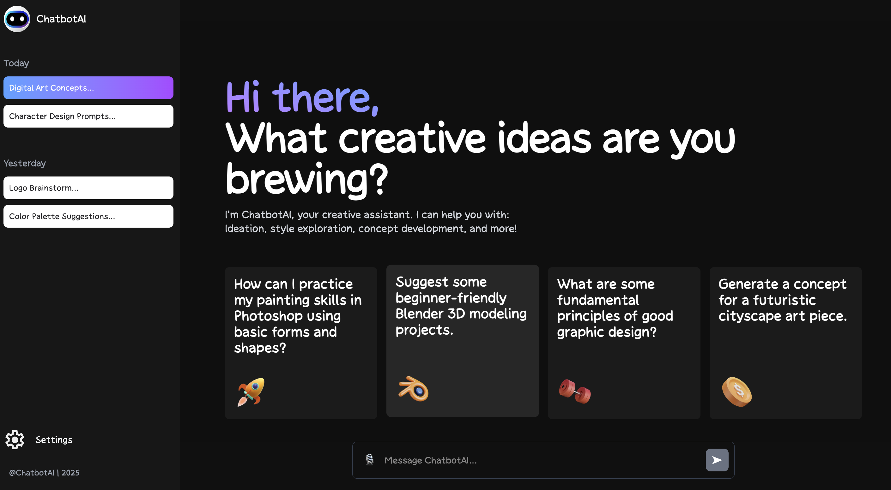
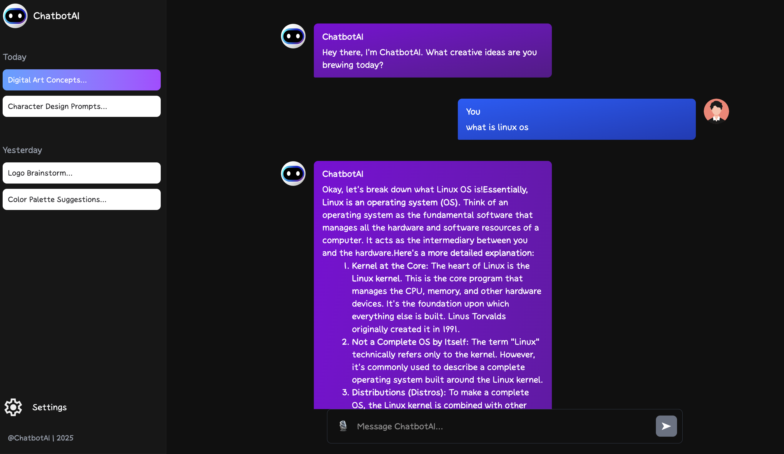

# Gemini Chatbot

This is a beginner-friendly React-based chatbot application designed to provide an interactive conversational experience. It leverages modern web technologies to deliver a smooth and responsive user interface.

## Table of Contents

- [About the Project](#about-the-project)
- [Features](#features)
- [Technologies Used](#technologies-used)
- [Project Structure](#project-structure)
- [Getting Started](#getting-started)
  - [Prerequisites](#prerequisites)
  - [Installation](#installation)
  - [Running the Application](#running-the-application)
- [Screenshots](#screenshots)
- [Contributing](#contributing)
- [License](#license)

## About the Project

This project is a simple yet effective chatbot application built with React. It demonstrates how to create a dynamic user interface for conversational agents, including input fields, message displays, and basic navigation. The goal is to provide a clear and understandable codebase for beginners interested in React and front-end development.

## Live link:

- Click here to see live demo: [Gemini Chatbot](https://gemini-chatbot-741475.netlify.app/)

## Features

- Interactive chat interface
- Responsive design
- Easy to understand code structure
- Integration with modern styling and animation libraries

## Technologies Used

This project is built using the following key technologies and libraries:

- **React**: A JavaScript library for building user interfaces.
- **Vite**: A fast build tool that provides a lightning-fast development experience.
- **Tailwind CSS**: A utility-first CSS framework for rapidly building custom designs.
- **GSAP (GreenSock Animation Platform)**: A powerful JavaScript animation library for creating high-performance animations.
- **Locomotive Scroll**: A library for smooth scrolling effects.
- **React Icons**: A collection of popular icon packs as React components.
- **ESLint**: A tool for identifying and reporting on patterns found in ECMAScript/JavaScript code, with the goal of making code more consistent and avoiding bugs.

## Project Structure

The project is organized into the following main directories and files:

- `public/`: Contains static assets like images, fonts, and the `index.html` file.
  - `public/images/`: Stores all image assets, including `chatbot.png` and `response.png`.
  - `public/fonts/`: Contains custom font files.
- `src/`: Contains the core source code for the React application.
  - `src/App.jsx`: The main application component.
  - `src/main.jsx`: The entry point of the React application.
  - `src/index.css`: Global CSS styles.
  - `src/components/`: Reusable React components.
    - `ChatInput.jsx`: Component for user input.
    - `ChatMessage.jsx`: Component for displaying individual chat messages.
    - `NavBar.jsx`: Navigation bar component.
    - `Sidebar.jsx`: Sidebar component.
    - `WelcomeScreen.jsx`: Component for the initial welcome display.
  - `src/helpers/`: Contains helper functions or utilities.
    - `typingEffect.jsx`: Logic for typing animation effects.
  - `src/utils/`: Contains general utility functions.
    - `utils.js`: Various utility functions.
- `package.json`: Defines project metadata and lists all dependencies.
- `vite.config.js`: Vite configuration file.
- `eslint.config.js`: ESLint configuration for code linting.
- `README.md`: This file, providing an overview of the project.
- `LICENSE`: The project's license file.
- `.gitignore`: Specifies intentionally untracked files to ignore.

## Getting Started

Follow these instructions to get a copy of the project up and running on your local machine for development and testing purposes.

### Prerequisites

Before you begin, ensure you have Node.js and npm (Node Package Manager) installed on your system.

- **Node.js**: [Download & Install Node.js](https://nodejs.org/en/download/) (npm is included with Node.js installation)

### Installation

1. **Clone the repository:**

   ```bash
   git clone https://github.com/your-username/gemini-chatbot.git
   cd gemini-chatbot
   ```

2. **Install dependencies:**
   ```bash
   npm install
   ```

### Running the Application

To run the application in development mode:

```bash
npm run dev
```

This command will start the Vite development server, and you can access the application in your web browser, usually at `http://localhost:5173/`.

To build the application for production:

```bash
npm run build
```

This command will compile the project into static files in the `dist` directory, which can then be deployed to a web server.

## Screenshots

Here are some screenshots of the Gemini Chatbot in action:

### Chatbot Interface



### Response Example



## Contributing

Contributions are welcome! If you have suggestions for improvements or new features, please feel free to open an issue or submit a pull request.

## License

This project is licensed under the MIT License - see the [LICENSE](LICENSE) file for details.
